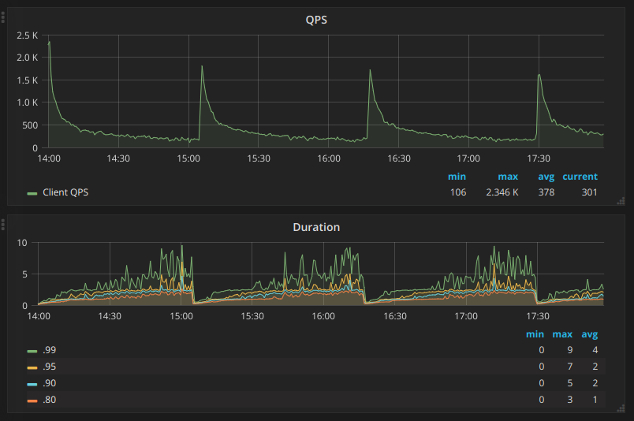
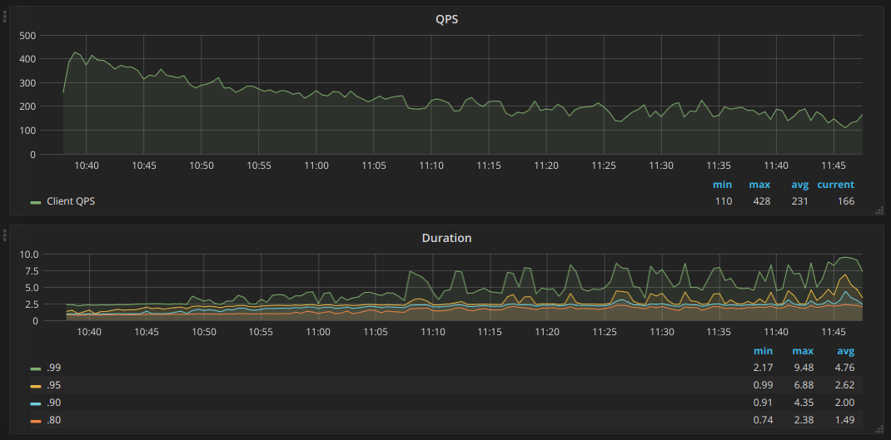

# dgraph-bench

A benchmark program for dgraph.

## Benchmark Results

All tests are on servers with multi-way Intel(R) Xeon(R) CPU E5-2630 v3 @ 2.40GHz,
32 virtual cores on each server.

Each server has 64G memory, and a 500GB SATA SSD:

| Parameter            | Evaluation           |
|----------------------|----------------------|
| Max Sequential Read  | 560 MBps             |
| Max Sequential Write | 530 MBps             |
| 4KB Random Read      | 95,000 IOPS          |
| 4KB Random Write     | 84,000 IOPS          |

### Simple Node Insertion

Af the first step, we tried to insert single node into dgraph, in different
cluster configurations.

#### 1 zero, 1 alpha, 100 concurrent goroutines, no index (v1.0.9)

The performance is not bad, considered that the concurrency is 100 and there is
a 20ms cool down for each call. Meanwhile the CPU load is low:

#### 1 zero, 3 alpha, 100 concurrent goroutines, no index (v1.0.9)

Now we see a poor performance. The CPU load is still not high:

Machine 1 (with zero and ratel):

Mchine 2 and 3:

After one hour of running, we noticed a performance jump, followed by the same
performance drop.

#### 1 zero, 3 alpha, 100 concurrent goroutines, with index (v1.0.9)

We see a clear pattern in which the performance jump up followed by a
exponential drop down.

### Edge Insertion

Before testing edge insertion, we inserted 3.3+ million people nodes to dgraph.
In this test, it picks randomly two persons, then connects them as friends.

The edge insertion is also slow, with a continuous descreasing trend. As always,
the server side CPU load is rather low.
